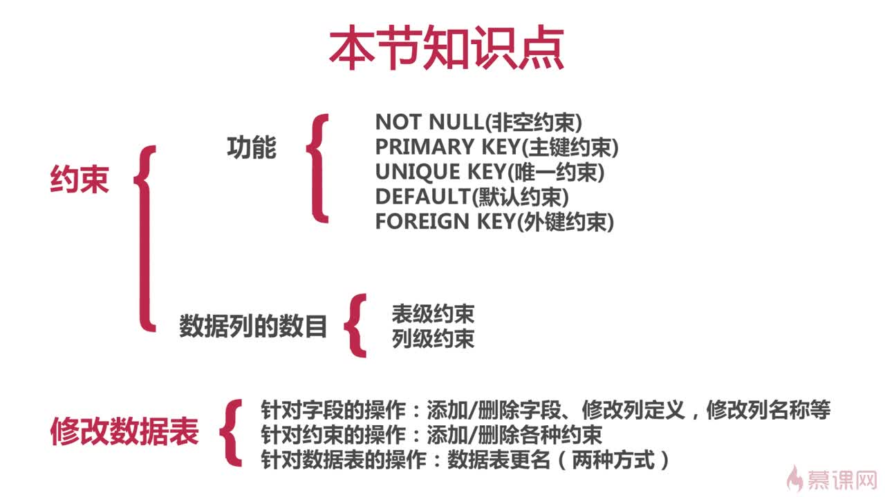
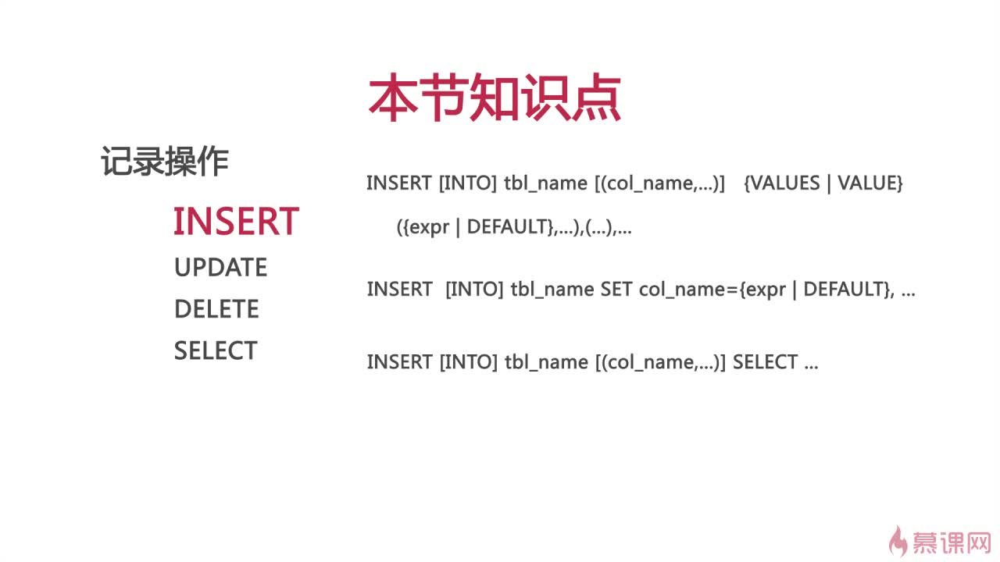
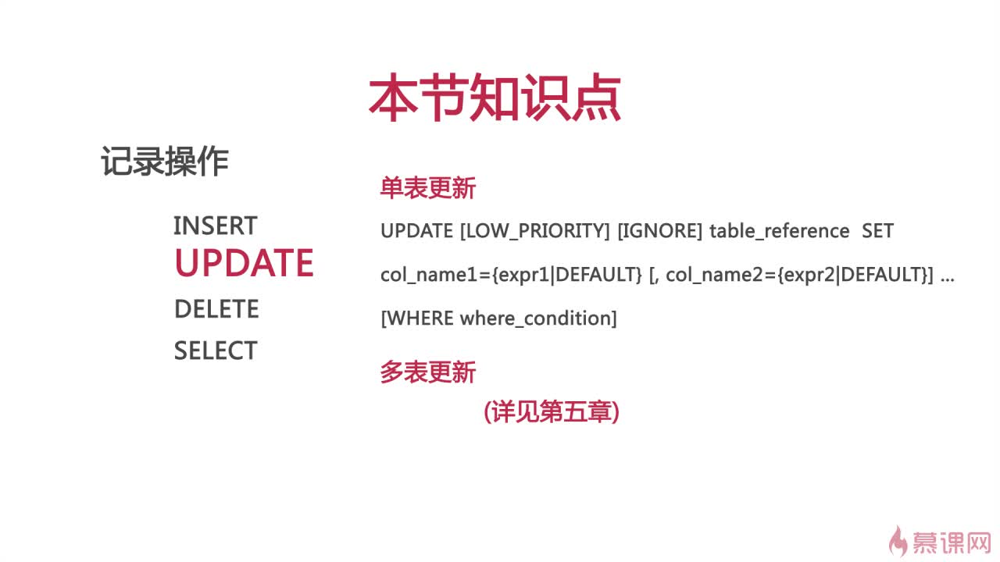
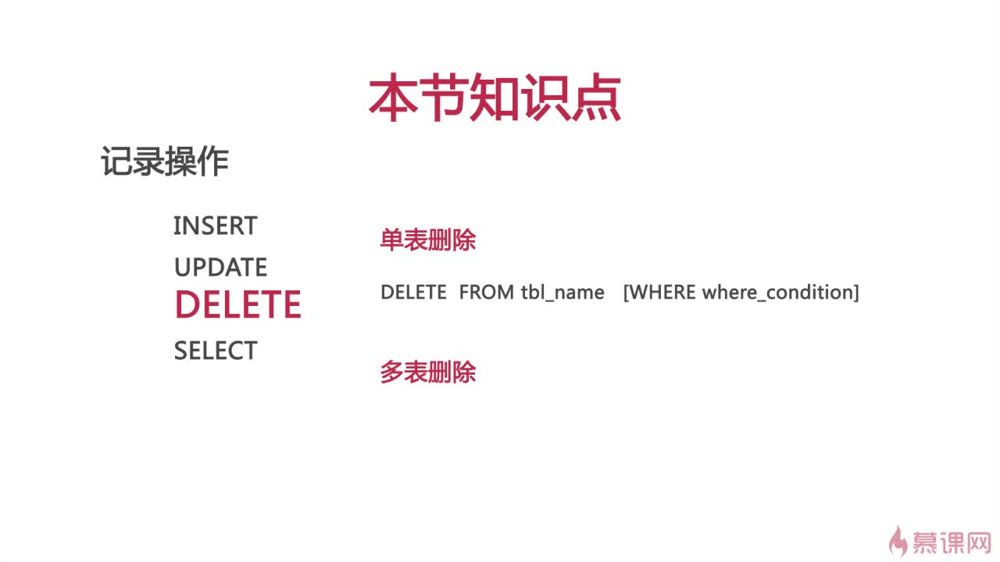
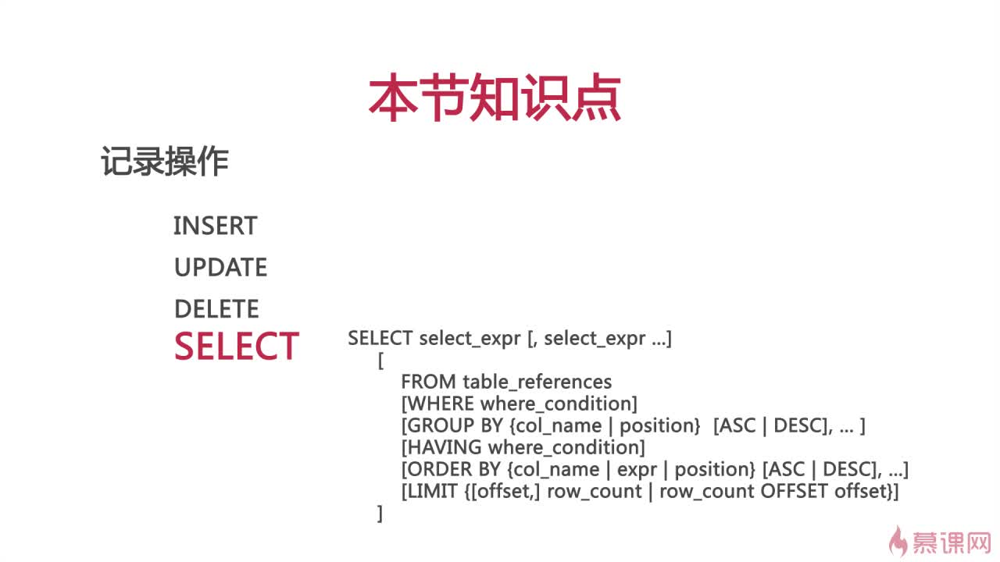

### 第一章 初涉Mysql
#### 一、 启动关闭 MySQL
mac && windows
```
mysql.server start
mysql.server stop

net start mysql
net stop mysql
```

| 参数                  | 描述        |
|:--------------------|:----------|
| -D, --database=name | 打开指定数据库   |
| --delimiter=name    | 指定分隔符     |
| －h, --host=name     | 服务器名称     |
| －p, --password=name | 密码        |
| －P, --port=#        | 端口号       |
| －-prompt=name       | 设置提示符     |
| －u, --user=name     | 用户名       |
| －V, --version=name  | 输出版本信息并退出 |

mysql 默认端口 3306  
默认超级管理员 root

#### 二、 MySQL 提示符
1. 进入MySQL环境前， --prompt 跟随参数
2. 进入MySQL环境后， 输入prompt 跟随参数

| 参数 | 描述     |
|:---|:-------|
| \D | 完整的日期  |
| \d | 当前的数据库 |
| \h | 数据库名称  |
| \u | 当前用户   |

#### 三、 退出 MySQL
```
exit;
quit;
\q;
```

#### 四、 MySQL语句的规范
1. 关键字与函数名称全部大写
2. 数据库名称、表名称、字段名称全部小写
3. SQL语句必须以分号结尾

#### 五、 常用命令
1. 显示当前服务器版本 `SELECT VERSION();`
2. 显示当前日期时间 `SELECT NOW();`
3. 显示当前用户 `SELECT USER();`
4. 创建数据库 `CREATE {DATABASE | SCHEMA} [IF NOT EXISTS] db_name;`  
    花括号为必选的，中间竖线代表从中选择，中括号可有可无
5. 查看数据库 `SHOW {DATABASES | SCHEMAS};`
6. 查看警告信息 `SHOW WARNINGS;`
7. 修改数据库 `ALTER {DATABASE | SCHEME} [db_name];`
8. 删除数据库 `DROP {DATABASE | SCHEMA} [IF EXISTS] db_name;`
9. 删除数据表 `DROP TABLE [IF EXISTS] table_name;`


----------


### 第二章 数据类型与操作数据表
#### 一. MySQL数据类型之整型
数据存储选用合适的数据类型，而不是最大的数据类型，节省空间

#### 二、数据表操作（插入记录与查找记录）
##### 1) 创建数据表
```
CREATE TABLE [IN NOT EXISTS] table_name(
    column_name data_type [NOT NULL] [UNIQUE KEY] [PRIMARY KEY],
);

1. NOT NULL 非空约束
2. unique key 唯一约束
2. default 默认约束
3. primary key 主键约束
    * 每张数据表当中只能存在一个主键
    * 主键保证记录的唯一性
    * 主键自动为 NOT NULL

mysql> create table tbl(
    -> id smallint auto_increment primary key,
    -> username varchar(30) not null unique key,
    -> age tinyint unsigned,
    -> salary float(8, 2) unsigned
    -> );
```

##### 2) 查看数据表结构 `SHOW COLUMNS FROM table_name`
```
mysql> show columns from tbl;
+----------+---------------------+------+-----+---------+----------------+
| Field    | Type                | Null | Key | Default | Extra          |
+----------+---------------------+------+-----+---------+----------------+
| id       | smallint(6)         | NO   | PRI | NULL    | auto_increment |
| username | varchar(30)         | NO   | UNI | NULL    |                |
| age      | tinyint(3) unsigned | YES  |     | NULL    |                |
| salary   | float(8,2) unsigned | YES  |     | NULL    |                |
+----------+---------------------+------+-----+---------+----------------+
```
##### 3) 插入记录 `INSERT [INTO] table_name [(column_name, ...)] VALUES(val, ...);`
`insert tbl (username, age, salary) values('gena', 25, 19);`

##### 4) 记录查找 `SELECT expr,... from table_name`
```
mysql> select * from tbl;
+----+----------+------+--------+
| id | username | age  | salary |
+----+----------+------+--------+
|  1 | tom      |   23 |  17.00 |
|  2 | john     |   24 |  18.00 |
|  3 | gena     |   25 |  19.00 |
+----+----------+------+--------+
3 rows in set (0.00 sec)
```

##### 5) 显示当前所使用的数据库 `SELECT DATABASE();`

##### 6) 查看数据表 `SHOW TABLES [from db_name]`
    1. 查看当前数据库的数据表 `show tables` 
    2. 查看其它数据库的数据表 `show tables from db_name`

----------


### 第三章 约束以及修改数据表 ———— 修改列

#### 一. 约束
1. 约束保证数据的完整性和一致性
2. 约束分为表级约束和列级约束
    * 列级约束：约束只针对一个字段
    * 表级约束：约束针对两个及以上的字段
3. 约束类型包括：
    * NOT NULL 非空约束
    * PRIMARY KEY 主键约束
    * UNIQUE KEY 唯一约束
    * DEFAULT 默认约束
    * FOREIGN KEY 外键约束（保持数据一致性，完整性。实现一对一或一对多关系） 


#### 二、 MySQL外间约束的要求解析
1. 父表和子表必须使用相同的存储引擎，而且禁止使用临时表。  
    编辑数据表的默认存储引擎 MySQL配置文件中修改 `default-storage-engine=INNODB`
2. 数据表的存储引擎只能为 InnoDB
3. 外键列和参照列必须具有相似的数据类型。其中数字的长度或是否有符号位必须相同；而字符的长度则可以不同
4. 外键列和参照列必须创建索引。如果外键列不存在索引的话，MySQL将自动创建索引。

```
父表
mysql> create table province(
    -> id smallint unsigned primary key auto_increment,
    -> pname varchar(20) not null
    -> );
mysql> show columns from province;
+-------+----------------------+------+-----+---------+----------------+
| Field | Type                 | Null | Key | Default | Extra          |
+-------+----------------------+------+-----+---------+----------------+
| id    | smallint(5) unsigned | NO   | PRI | NULL    | auto_increment |
| pname | varchar(20)          | NO   |     | NULL    |                |
+-------+----------------------+------+-----+---------+----------------+


==========================
子表

mysql> create table users(
    -> id smallint unsigned primary key auto_increment,
    -> username varchar(10) not null,
    -> pid smallint unsigned,
    -> foreign key (pid) references province(id)
    -> );

mysql> show columns from users;
+----------+----------------------+------+-----+---------+----------------+
| Field    | Type                 | Null | Key | Default | Extra          |
+----------+----------------------+------+-----+---------+----------------+
| id       | smallint(5) unsigned | NO   | PRI | NULL    | auto_increment |
| username | varchar(10)          | NO   |     | NULL    |                |
| pid      | smallint(5) unsigned | YES  | MUL | NULL    |                |
+----------+----------------------+------+-----+---------+----------------+
```

查看索引 `SHOW INDEXES FROM table_name[\G];`

```
mysql> show indexes from province\G;
*************************** 1. row ***************************
        Table: province
   Non_unique: 0
     Key_name: PRIMARY
 Seq_in_index: 1
  Column_name: id
    Collation: A
  Cardinality: 0
     Sub_part: NULL
       Packed: NULL
         Null:
   Index_type: BTREE
      Comment:
Index_comment:
1 row in set (0.00 sec)

ERROR:
No query specified

mysql> show indexes from users\G;
*************************** 1. row ***************************
        Table: users
   Non_unique: 0
     Key_name: PRIMARY
 Seq_in_index: 1
  Column_name: id
    Collation: A
  Cardinality: 0
     Sub_part: NULL
       Packed: NULL
         Null:
   Index_type: BTREE
      Comment:
Index_comment:
*************************** 2. row ***************************
        Table: users
   Non_unique: 1
     Key_name: pid
 Seq_in_index: 1
  Column_name: pid
    Collation: A
  Cardinality: 0
     Sub_part: NULL
       Packed: NULL
         Null: YES
   Index_type: BTREE
      Comment:
Index_comment:
2 rows in set (0.00 sec)

ERROR:
No query specified
```


#### 三、外键约束的参照操作
1. CASCADE: 从父表删除或更新且自动删除或更新子表中匹配的行
2. SET NULL: 从父表删除或更新，并设置子表中的外键列为NULL。如果使用改选项，必须保证子表列没有指定 NOT NULL
3. RESTRICT: 拒绝对父表的删除或更新操作
4. NO ACTION: 标准SQL的关键字，在MySQL中与RESTRICT相同

```
1. 创建 有参数的 子表 
mysql> create table users1(
    -> id smallint unsigned primary key auto_increment,
    -> username varchar(10) not null,
    -> pid smallint unsigned,
    -> foreign key (pid) references province(id) on delete cascade
    -> );

2. 父表插入一些内容 
mysql> insert province(pname) values('A');
mysql> select * from province;
+----+-------+
| id | pname |
+----+-------+
|  1 | A     |
|  2 | B     |
|  3 | C     |
+----+-------+

3. users1 表中
mysql> insert users1(username, pid) values('Tom', 3);
Query OK, 1 row affected (0.00 sec)

mysql> insert users1(username, pid) values('John', 3);
Query OK, 1 row affected (0.01 sec)

mysql> insert users1(username, pid) values('rose', 1);
Query OK, 1 row affected (0.00 sec)

mysql> select * from users1;
+----+----------+------+
| id | username | pid  |
+----+----------+------+
|  1 | Tom      |    3 |
|  2 | John     |    3 |
|  3 | rose     |    1 |
+----+----------+------+

4. 删除父表的一条记录
mysql> delete from province where id = 3;
Query OK, 1 row affected (0.02 sec)

mysql> select * from users1;
+----+----------+------+
| id | username | pid  |
+----+----------+------+
|  3 | rose     |    1 |
+----+----------+------+
```


#### 四、表级约束与列级约束
1. 对一个数据列建立的约束，称为列级约束
2. 对多个数据列建立的约束，称为表级约束
3. 列级约束既可以在列定义时声明，也可以在列定义后声明
4. 表级约束只能在列定义后声明

#### 五、修改数据表(列)
数据表的修改：列的添加，列的删除，约束的添加，约束的删除  
`ALTER TABLE table_name {ADD | DROP } [column_name]`

##### 1) 添加单列  
`ALTER TABLE table_name ADD [COLUMN] column_name column_definition [FIRST|AFTER column_name]`  
`AFTER diy_column_name` 插入的列位于 跟随列名（diy_column_name）之后  
`FIRST` 插入的列位于 最前面  
alter table users1 add password varchar(32) not null after username;  

```
mysql> show columns from users1;
+----------+----------------------+------+-----+---------+----------------+
| Field    | Type                 | Null | Key | Default | Extra          |
+----------+----------------------+------+-----+---------+----------------+
| id       | smallint(5) unsigned | NO   | PRI | NULL    | auto_increment |
| username | varchar(10)          | NO   |     | NULL    |                |
| pid      | smallint(5) unsigned | YES  | MUL | NULL    |                |
+----------+----------------------+------+-----+---------+----------------+
3 rows in set (0.00 sec)

mysql> alter table users1 add age tinyint unsigned not null default 10;
Query OK, 0 rows affected (0.07 sec)
Records: 0  Duplicates: 0  Warnings: 0

mysql> show columns from users1;
+----------+----------------------+------+-----+---------+----------------+
| Field    | Type                 | Null | Key | Default | Extra          |
+----------+----------------------+------+-----+---------+----------------+
| id       | smallint(5) unsigned | NO   | PRI | NULL    | auto_increment |
| username | varchar(10)          | NO   |     | NULL    |                |
| pid      | smallint(5) unsigned | YES  | MUL | NULL    |                |
| age      | tinyint(3) unsigned  | NO   |     | 10      |                |
+----------+----------------------+------+-----+---------+----------------+
4 rows in set (0.00 sec)

mysql> alter table users1 add password varchar(32) not null after username;
Query OK, 0 rows affected (0.06 sec)
Records: 0  Duplicates: 0  Warnings: 0

mysql> show columns from users1;
+----------+----------------------+------+-----+---------+----------------+
| Field    | Type                 | Null | Key | Default | Extra          |
+----------+----------------------+------+-----+---------+----------------+
| id       | smallint(5) unsigned | NO   | PRI | NULL    | auto_increment |
| username | varchar(10)          | NO   |     | NULL    |                |
| password | varchar(32)          | NO   |     | NULL    |                |
| pid      | smallint(5) unsigned | YES  | MUL | NULL    |                |
| age      | tinyint(3) unsigned  | NO   |     | 10      |                |
+----------+----------------------+------+-----+---------+----------------+
5 rows in set (0.00 sec)
```

##### 2) 添加多列 —— 不能指定位置关系，只能添加在下方
`ALTER TABLE table_name ADD [COLUMN] (column_name column_definition, ...)`  
alter table users1 add (hehe varchar(21) not null, haha varchar(22) not null);

##### 3) 删除列
`ALTER TABLE table_name drop [column] column_name`  
alter table users1 hehe;  
alter table users1 drop test, drop password; 删除多列

#### 六、修改数据表 －－ 修改列定义和更名数据表
`ALTER TABLE table_name {MODIFY|CHANGE}`
##### 1) 修改列定义
`ALTER TABLE table_name MODIFY [COLUMN] column_name column_definition [FIRST|AFTER column_name]`  
alter table users2 modify id smallint unsigned not null first;

##### 2) 修改列名称（也需要添加上类型约束等）
`ALTER TABLE table_name CHANGE [COLUMN] old_column_name new_column_name column_definition [FIRST|AFTER column_name]`  
alter table users2 change pid p_id tinyint unsigned not null;

##### 3) 数据表更名
方法1. `ALTER TABLE table_name RENAME [TO|AS] new_table_name`  
方法2. `RENAME TABLE table_name TO new_table_name [, tbl_name2 TO new_tabl_name2]...`


#### 七、修改数据表 －－ 添加\删除约束
`ALTER TABLE table_name {ADD | DROP} ...`
##### 1.1) 添加主键约束
`ALTER TABLE table_name ADD [CONSTRAINT [symbol]] PRIMARY KEY [index_type] (index_column_name, ...)`  
alter table users2 add constraint pk_user2_id primary key (id);

##### 1.2) 删除主键约束
`ALTER TABLE table_name DROP PRIMARY KEY`  
alter table users2 drop primiary key;

##### 2.1) 添加唯一约束
`ALTER TABLE table_name ADD [CONSTRAINT [symbol]] UNIQUE [INDEK|KEY] [index_name] [index_type] (index_column_name, ...)`  
alter table users2 add unique (username);

##### 2.2) 删除唯一约束
`ALTER TABLE table_name DROP {INDEX|KEY} index_name`  
alter table users2 drop index username;

##### 3.1) 添加外键约束
`ALTER TABLE table_name ADD [CONSTRAINT [symbol]] FOREIGN KEY [index_name] (index_column_name, ...) references_definition`  
alter table users2 add foreign key (pid) references province (id);

##### 3.2) 删除外键约束
`ALTER TABLE table_name drop FOREIGN KEY fk_symbol`

##### 4) 添加/删除默认约束
`ALTER TABLE table_name ALTER [COLUMN] column_name {SET DEFAULT literal | DROP DEFAULT}`  
alter table users2 alter age set default 15;  添加  
alter table users2 alter age drop default;  删除

------------------

### 第四章 操作数据表中的记录（增删改查）———— 修改行
<div>
    
    
    
    
</div>

#### 一、MySQL插入记录 INSERT
1. `INSERT [INTO] tabl_name [(col_name, ...)] {VALUES | VALUE} ({expr | DEFAULT}, ...), (...), ...`  
insert users values(default, 'li', '123', 2 * 8, 1);  
insert users values(default, 'lfi', '123', 2 * 8, 1), (null, 'rose', md5('123'), default, 0); 插入多条记录
2. `INSERT [INTO] tabl_name SET col_name = {expr | DEFAULT}, ...`  
说明：与第一种方式的区别在于，此方法可以使用子查询（SubQuery）  
insert users set username = "ben", password="456";
3. `INSERT [INTO] tabl_name [(col_name, ...)] SELECT ...`  
说明：此方法可以将查询结果插入到指定数据表  

#### 二、单表更新记录 UPDATE
`UPDATE [LOW_PRIORITY] [IGNORE] table_reference SET col_name1 = {expr1 }| DEFAULT} [, col_name2 = {expr2 | DEFAULT}] ... [WHERE where_condition]`   
update users set age = age - id, sex = 0  
update users set age = age + 5 where id % 2 = 0;

#### 三、单表删除记录 DELETE
`DELECT FROM tabl_name [WHERE where_condition]`  
delete from users where id = 6;

#### 四 查找记录 SELECT
```
SELECT select_expr [, select_expr ...] (查看哪几列)
  [
    FROM table_references    //表的参照
    [WHERE where_condition]    //条件 (查看哪几行)
    [GROUP BY {col_name | position} [ASC | DESC], ...]    //记录分组
    [HAVING where_condition]    //对分组的条件进行设定
    [ORDER BY {col_name | expr | position} [ASC | DESC], ...]    //排序
    [LIMIT {[offset,] row_count | row_count OFFSET offset}]    //限制记录返回的数量
  ]
```
##### 1) 查询表达式  
1. 每一个表达式表示想要的一列，必须有至少一个
2. 每个列之间以英文逗号分隔
3. 星号 表示所有列。tbl_name.* 可以表示命名表的所有列
4. 查询表达式可以使用 [AS] alias_name 为其赋予别名
5. 别名可用于 GROUP BY, ORDER BY 或 HAVING 子句

##### 2) 条件表达式 WHERE
对记录进行过滤，如果没有指定 WHERE 子句，则显示所有记录。  
在 WHERE 表达式中，可以使用MySql支持的函数或运算符。

##### 3) 查询结果分组 GROUP BY
ASC 升序，DESC 降序  
select sex users group by sex;

##### 4) 分组条件 HAVING
SELECT age FROM users GROUP BY age  HAVING age > 20;

##### 5) 对查询结果进行排序 ORDER BY
select * from users order by id desc;

##### 6) 限制查询结果返回的数量
select * from users limit 2;  
select * from users limit 3,4; （索引从0开始）


### 第五章 子查询与连接

#### 一、子查询
##### 1) 简介
子查询指嵌套在查询内部，且始终出现在圆括号内。子查询（SubQuery）是指出现在其他SQL语句内的SELECT子句。  
```
SELECT * FROM t1 where col1 = (SELECT col2 from t2);
SELECT * FROM t1 ———— 称为 Outer Query/Outer Statement
SELECT col2 from t2 ———— 称为 SubQuery  

示例
select goods_id, goods_name, goods_price from tdb_goods where 
goods_price >= (select round(avg(goods_price),2) from tdb_goods);
```

##### 2) 修饰比较运算符
| 运算符\关键字 | ANY    | SOME   | ALL    |
|:--------|:-------|:-------|:-------|
| >、>=    | 最小值    | 最小值    | 最大值    |
| <、<=    | 最大值    | 最大值    | 最小值    |
| ＝       | 任意值    | 任意值    | 没有这个组合 |
| <>、!=   | 没有这个组合 | 没有这个组合 | 任意值    |


1. `ANY` 或者 `SOME` 等价，代表着只要符合其中一个结果即可
2. `ALL` 则是符合全部

##### 3) 使用 [NOT] IN 的子查询
1. `= ANY` 与 `IN` 等效
2. `!= ALL` 或 `<> ALL` 与 `NOT IN` 等效

#### 连接
##### 1) 使用 INSERT... SELECT 插入记录 `INSERT [INTO] table_name [(column_name, ...)] SELECT ...`  
insert tdb_goods_cates(cate_name) select goods_cate from tdb_goods group by goods_cate;

##### 2) 多表更新
```
UPDATE table_references 对两个表建立关系对等连接
SET column_name1={expr1|DEFAULT} [, column_name2={expr2|DEFAULT}]...
[WHERE where_condition]
```
mysql> update tdb_goods INNER JOIN tdb_goods_cates ON goods_cate = cate_name
    -> SET goods_cate = cate_id;

语法结构
```
table_reference
{[INNER | CROSS] JOIN | {LEFT | RIGHT} [OUTER] JOIN}
table_reference
ON condition_expr
```

##### 3) 多表更新之一步到位 CREATE... SELECT
创建数据表同时将查询结果写入到数据表  
```
CREATE TABLE [IF NOT EXISTS] table_name
[(create_definition, ...)]
select_statement
```

##### 4) 连接
MySQL 在 SELECT 语句、多表更新、多表删除语句中支持join操作。  
连接类型  

1.  INNER JOIN, 内连接，交集（在MySQL中，JOIN，CROSS JOIN 和 INNER JOIN 是等价的）
2.  LEFT [OUTER] JOIN, 左外连接
3.  RIGHT [OUTER] JOIN, 右外连接

连接条件  
使用 ON 关键字来设定连接条件，也可以使用 WHERE 来代替。通常使用 ON 关键字来设定连接条件，使用 WHERE 关键字来进行结果集记录的过滤。

##### 5) 多表连接
这里就是 将多个表结合为一个表，然后查询结合的这个表当中的内容
```
mysql> select goods_id, goods_name, cate_name, brand_name, goods_price from tdb_goods as g
    -> inner join tdb_goods_cates as c on g.cate_id = c.cate_id
    -> inner join tdb_goods_brands as b on g.brand_id = b.brand_id;
```

A LEFT JOIN B jion_condition  
数据表B的结果集依赖数据表A。  
数据表A的结果集根据左连接条件所有数据表（B除外）。  
左外连接条件决定如何检索数据表B（在没有指定WHERE条件的情况下）。  
如果数据表A的某跳记录符合WHERE条件，但是在数据表B不存在符合连接条件的记录，将生成一个所有列为空的额外的B行。

##### 6) 无限集分类表设计

----------

### 第六章 运算符和函数

#### 一、字符函数
| 函数名称          | 描述             |
|:--------------|:---------------|
| `CONCAT()`    | 字符连接           |
| `CONCAT_WS()` | 使用指定的分隔份进行字符连接 |
| `FORMAT()`    | 数字格式化          |
| `LOWER()`     | 转换成小写字母        |
| `UPPER()`     | 转换成大写字母        |
| `LFET()`      | 获取左侧字符         |
| `RIGHT()`     | 获取右侧字符         |
| `LENGTH()`    | 获取字符串长度        |
| `LTRIM()`     | 删除前导空格         |
| `RTRIM()`     | 删除后续空格         |
| `TRIM()`      | 删除前导后续空格       |
| `SUBSTRING()` | 字符串截取          |
| `[NOT]LIKE()` | 模式匹配           |
| `REPLACE()`   | 字符串替换          |

##### 1) `select concat('aaa', 'bbb');`
select 为查询功能。事实上感觉起来他更像是输出功能，如一些数据表的查询，它只是负责将后面的结果输出的命令行

##### 2) 示例
1. `select concat_ws('|', first_name, last_name) as fullname from test;
`
2. `select lower(right('ABCDE', 3));`
3. `select trim(both '?' from '????MySql??'); → MySQL`
4. `select trim(leading '?' from '????MySql??');  →  MySql??`
5. `select trim(trailing '?' from '????MySql??'); →  ????MySql`
6. `select replace('???MySql--??', '?', '*'); →  ***MySql--**`
7. `select substring('abcdef', 1, 3);  →  abc MySQL当中是从1开始不是0`
8. `select * from test where first_name like '%o%';`
9. `select * from test where first_name like '%1%' escape '1'; escape '1' 代表 1之后的 ％ 不是通配符而就是 简单的匹配 百分号`

#### 二、数值运算符与函数
| 函数名称         | 描述     |
|:-------------|:-------|
| `CEIL()`     | 进一取整   |
| `DIV`        | 整数除法   |
| `FLOOR()`    | 舍一取整   |
| `MOD`        | 取余数/取模 |
| `POWER()`    | 幂运算    |
| `ROUND()`    | 四舍五入   |
| `TRUNCATE()` | 数字截取   |

#### 三、比较运算符与函数
| 函数名称                     | 描述          |
|:-------------------------|:------------|
| `[NOT] BETWEEN...AND...` | [不]在范围之内    |
| `[NOT] IN()`             | [不]在列出值范围之内 |
| `IS [NOT] NULL`          | [不]为空       |

#### 四、日期时间函数
| 函数名称            | 描述     |
|:----------------|:-------|
| `NOW()`         | 当前日期时间 |
| `CURDATE()`     | 当前日期   |
| `CURTIME()`     | 当前时间   |
| `DATE_ADD()`    | 日期变化   |
| `DATE_DIFF()`   | 日期差值   |
| `DATE_FORMAT()` | 日期格式化  |

1. `select date_add('2013-10-1', interval 356 day);  →  2014-09-22`
2. `select datediff('2011-12-01', '2012-12-01');  →  －366`
3. `select date_format('2013-12-21', '%m/%d/%Y');  →  12/21/2013`

#### 五、信息函数
| 函数名称               | 描述         |
|:-------------------|:-----------|
| `CONNECTION_ID()`  | 连接ID       |
| `DATABASE()`       | 当前数据库      |
| `LAST_INSERT_ID()` | 最后插入记录的ID号 |
| `USER()`           | 当前用户       |
| `VERSION()`        | 版本信息       |

#### 六、聚合函数
| 函数名称      | 描述  |
|:----------|:----|
| `AVG()`   | 平均值 |
| `COUNT()` | 计数  |
| `MAX()`   | 最大值 |
| `MIN()`   | 最小值 |
| `SUM()`   | 求和  |

#### 七、加密函数
| 函数名称         | 描述     |
|:-------------|:-------|
| `MD5()`      | 信息摘要算法 |
| `PASSWORD()` | 密码算法   |

----------

### 第七章 自定义函数简介
用户自定义函数(user-defined function, UDF)，是一种对MySQL扩展的途径，其用户与内置函数相同

无参数  
```
mysql> create function f1() returns varchar(40)
    -> return date_format(now(), '%Y年%m月%d日 %H点:%i分:%s秒');
Query OK, 0 rows affected (0.01 sec)

mysql> select f1();
+-------------------------------------+
| f1()                                |
+-------------------------------------+
| 2018年11月08日 16点:36分:10秒       |
+-------------------------------------+
1 row in set (0.01 sec) 
```

有参数 
```
mysql> create function f2(num1 smallint unsigned, num2 smallint unsigned)
    -> returns float(10, 2) unsigned
    -> return (num1 + num2) / 2;
Query OK, 0 rows affected (0.00 sec)

mysql> select f2(12, 32);
+------------+
| f2(12, 32) |
+------------+
|      22.00 |
+------------+
1 row in set (0.01 sec)
```


----------

### 第八章 自定义函数简介
1. 存储过程：是SQL语句和控制语句的预编译集合，以一个名称存储并作为一个单元处理。
2. 参数：输入类型，输出类型，输入&&输出；
3. 创建：CREATE...PROCEDURE...;
4. 注意事项：
    * 创建存储过程或者自定义函数时需要通过delimiter语句修改定界符。
    * 如果函数体或过程体有多个语句，需要包含在BEGIN...END语句块中。
    * 存储过程通过call调用。

#### 一、创建存储过程
##### 1) 语法结构
```
CREATE
[DEFINER={user|CURRENT_USER}] 指定哪个用户创建的这个存储过程
PROCEDURE sp_name([proc_paremeter[,…]])
[characteristic…] routine_body

proc_paremeter:
[IN|OUT|INOUT]param_name type
```

##### 2) 参数释义
1. in:表示该参数的值必须在调用存储过程时指定；
2. out:表示该参数的值可以被存储过程改变，并且可以返回；
3. inout:表示该参数在调用时指定，并且可以被改变和返回

##### 3) 特性
1. COMMENT:注释
2. CONTAINS SQL:包含sql语句，但不包含读或者写数据的语句；
3. NOT SQL：不包含sql语句；
4. READS SQL DATA:包含读数据的语句；
5. MODIFIES SQL DATEA:包含写数据的语句；
6. SQL SECURITY{DEFINER|INVOKER}:指明谁有权限连执行
 
##### 4) 过程体
1. 过程体由合法的sql语句构成；
2. 过程体可以是任意的sql语句；
3. 过程体如果为复合结构则使用begin_end语句；
4. 复合结构可以包含声明、循环、控制结构

创建不带参数的存储过程  
```
mysql> create procedure sp1() select version();
Query OK, 0 rows affected (0.00 sec)

mysql> call sp1();
+-----------+
| version() |
+-----------+
| 5.7.24    |
+-----------+
1 row in set (0.01 sec)
```

----------

### 第九章 存储引擎
####一、设置存储引擎
##### 1) 通过修改mysql配置文件实现：
default-storage-engine=engine;
##### 2) 通过创建数据表命令来实现
```
create table table_name(
……
……
)engine=engine;
```
##### 3) 修改数据表的存储引擎
ALTER tb_name engine =engine
